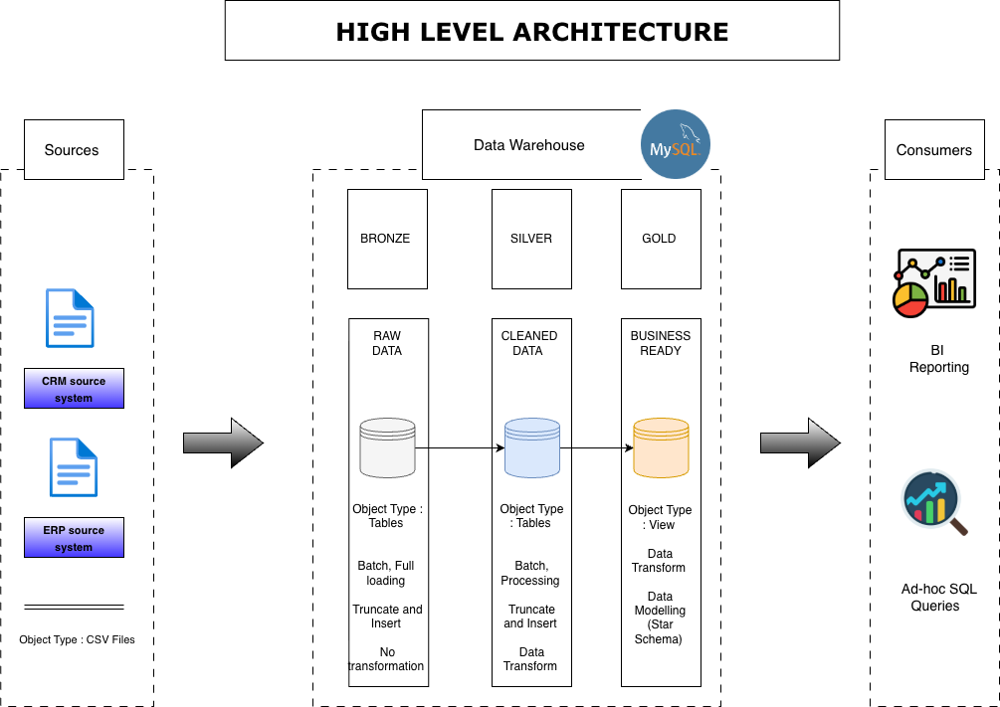

# Modern Data Warehouse & Analytics Project

Welcome to my **Modern Data Warehouse and Analytics Project** repository.  
This project showcases an end-to-end data engineering and analytics workflow, from raw data ingestion to business-ready analytics, following industry-standard data warehousing practices.

This repository is designed as a **portfolio project** to demonstrate my capabilities in:
- Data Engineering
- SQL Development
- Data Modeling
- Analytics & Reporting
- Healthcare / Business-focused data analysis

---

## 🏗️ Data Architecture

This project follows the **Medallion Architecture** pattern using **Bronze**, **Silver**, and **Gold** layers to ensure scalability, data quality, and analytics readiness.



### Architecture Layers

1. **Bronze Layer (Raw Data)**
   - Stores raw source data exactly as received
   - Data ingested from CSV source systems into SQL Server
   - No transformations applied

2. **Silver Layer (Clean & Standardized Data)**
   - Data cleansing and validation
   - Standardization of formats and values
   - Removal of duplicates and invalid records
   - Business-logic friendly structures

3. **Gold Layer (Analytics & Reporting)**
   - Business-ready data
   - Modeled using a **star schema**
   - Optimized for analytical queries, reporting, and dashboards

---

## 📖 Project Overview

This project demonstrates a complete **modern data warehouse lifecycle**, including:

1. **Data Architecture Design**
   - Medallion architecture (Bronze, Silver, Gold)
   - Clear separation of raw, cleaned, and analytical data

2. **ETL Development**
   - SQL-based extraction, transformation, and loading
   - Data quality checks and validations
   - Reproducible, modular SQL scripts

3. **Data Modeling**
   - Fact and dimension tables
   - Star schema design optimized for analytics
   - Business-friendly naming conventions

4. **Analytics & Reporting**
   - SQL-based analytical queries
   - Insights into customers, products, and sales performance
   - Metrics suitable for BI tools such as Tableau or Power BI

---

## 🎯 Why This Project Matters

This repository reflects **real-world data warehouse design**, not academic exercises.  
It demonstrates how I approach problems as a professional data analyst/data engineer:

- Designing scalable data architectures
- Writing clean, production-style SQL
- Modeling data for fast, flexible analytics
- Delivering insights that support business decisions

---
## 🛠️ Tools & Technologies

All tools used in this project are free and industry-relevant:

- **MySQL** – Relational database platform used to build the data warehouse  
- **MySQL Workbench** – Database design, development, and management environment  
- **CSV Source Systems** – Simulated ERP and CRM data sources  
- **Draw.io** – Architecture, data flow, and data modeling diagrams  
- **GitHub** – Version control and portfolio hosting  

---

## 🚀 Project Requirements

### Data Engineering Objective

Design and implement a modern data warehouse using **MySQL** that consolidates data from multiple source systems into a unified analytical data model.  
The warehouse is built to support efficient analytical queries, reporting, and data-driven decision-making.

### Specifications

- **Data Sources**
  - Two source systems (ERP & CRM) provided as CSV files

- **Data Quality**
  - Cleansing and validation before analytics
  - Handling missing, invalid, and inconsistent data

- **Integration**
  - Unified analytical data model
  - Business-friendly schema design

- **Scope**
  - Focus on the latest available data
  - No historization required for this project

- **Documentation**
  - Clear documentation for both technical and non-technical stakeholders

---

## 📊 Analytics & Reporting Objectives

SQL-based analytics are developed to provide insights into:

- **Customer Behavior**
- **Product Performance**
- **Sales Trends**

These outputs are designed to be directly consumable by BI tools or downstream analytics workflows.

More details can be found in: docs/requirements.md

---

## 📂 Repository Structure

```text
data-warehouse-project/
│
├── datasets/                           # Raw source data (ERP & CRM CSV files)
│
├── docs/                               # Documentation & diagrams
│   ├── etl.drawio                      # ETL techniques and workflow
│   ├── data_architecture.drawio        # Overall data architecture
│   ├── data_catalog.md                 # Dataset definitions and metadata
│   ├── data_flow.drawio                # Data flow diagram
│   ├── data_models.drawio              # Star schema data models
│   ├── naming-conventions.md           # Naming standards
│
├── scripts/                            # SQL scripts
│   ├── bronze/                         # Raw data ingestion
│   ├── silver/                         # Data cleansing & transformation
│   ├── gold/                           # Analytics-ready models
│
├── tests/                              # Data quality and validation scripts
│
├── README.md                           # Project overview
├── LICENSE                             # MIT License
├── .gitignore                          # Git ignore rules
└── requirements.txt                    # Project requirements
```

👤 About Me

Imanuel Annoh
Data Analyst | Data Scientist
📍 Manchester, Connecticut
	•	Master’s Degree in Data Science
	•	Background in Biology and Healthcare Analytics
	•	Experienced with SQL, Python, R, Tableau, Power BI, and data engineering workflows
	•	Interested in healthcare, public sector, and business analytics roles

🔗 LinkedIn: https://linkedin.com/in/imanuelannoh
🔗 GitHub: https://github.com/annohimanuel
